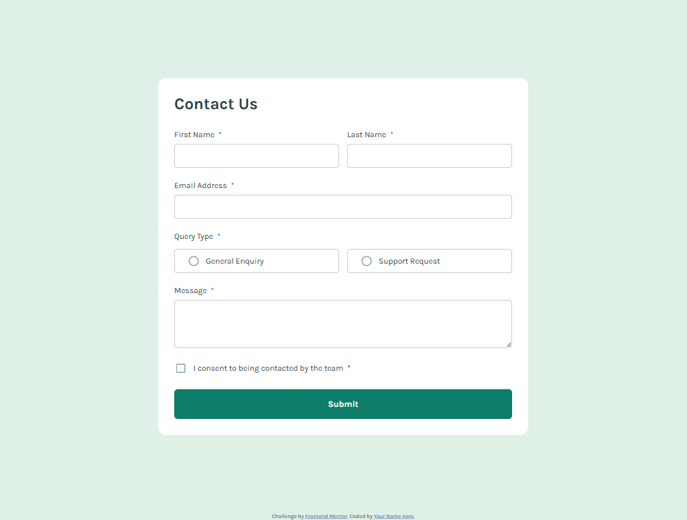
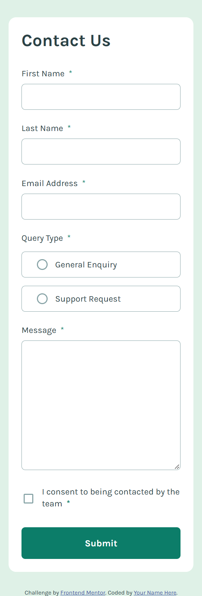

# Frontend Mentor - Contact form solution

This is a solution to the [Contact form challenge on Frontend Mentor](https://www.frontendmentor.io/challenges/contact-form--G-hYlqKJj).
The project is a responsive contact form built from scratch with semantic HTML, CSS, and vanilla JavaScript. It includes custom form validation, responsive layouts, interactive states, and an animated success notification.

## Table of contents

- [Overview](#overview)
  - [The challenge](#the-challenge)
  - [Screenshot](#screenshot)
  - [Links](#links)
- [My process](#my-process)
  - [Built with](#built-with)
  - [What I learned](#what-i-learned)
  - [Continued development](#continued-development)
  - [Useful resources](#useful-resources)
  - [AI Collaboration](#ai-collaboration)
- [Acknowledgments](#acknowledgments)

## Overview

### The challenge

Users should be able to:

- Complete the form and see a success toast message upon successful submission
- Receive form validation messages if:
  - A required field has been missed
  - The email address is not formatted correctly
- Complete the form only using their keyboard
- Have inputs, error messages, and the success message announced on their screen reader
- View the optimal layout for the interface depending on their device's screen size
- See hover and focus states for all interactive elements on the page

### Screenshot





### Links

-  Live Site URL: [Live Demo here](https://stephany247.github.io/contact-form-main/)
- Solution URL: [Github Repo](https://github.com/stephany247/contact-form-main)

## My process

### Built with

- Semantic HTML5 markup
- CSS custom properties
- Flexbox
- CSS Grid
- Mobile-first workflow
- Vanilla JavaScript
- Custom form validation
- CSS transitions and animations

### What I learned

UThis project helped me improve my understanding of building interactive forms without relying on a framework or external validation library.

One of the main things I practiced was creating custom validation states with JavaScript. Instead of relying entirely on the browser's default validation UI, I used novalidate and handled the validation manually.

For example:

```js
if (firstName.value.trim() === "") {
  showError(firstName, "This field is required");
  isValid = false;
}
```

I also learned how to create custom radio buttons and checkboxes while keeping the actual form inputs accessible.

Another important part of the project was creating an animated success notification using CSS transforms and transitions:

```css
.success-message {
  transform: translate(-50%, -150%);
  opacity: 0;
  transition:
    transform 0.5s ease,
    opacity 0.5s ease;
}

.success-message.show {
  transform: translate(-50%, 0);
  opacity: 1;
}
```


### Continued development

For future projects, I want to continue improving:

- Accessibility and screen reader support.
- More advanced form validation.
- Keyboard navigation and focus - management.
- Writing cleaner and more reusable - JavaScript functions.
- Creating smoother and more accessible animations.
- Improving my understanding of semantic - HTML.
- Building more complex projects without relying heavily on frameworks.


### Useful resources

- [Frontend Mentor](https://www.frontendmentor.io/) - The platform and challenge used for this project.
- [MDN Web Docs](https://developer.mozilla.org/) - Helpful reference for HTML, CSS, JavaScript, form validation, and browser APIs.


### AI Collaboration

I used ChatGPT as a development assistant during this project.

I mainly used AI to:

- Debug JavaScript validation logic.
- Improve custom form error states.
- Troubleshoot the success notification animation.
- Review and refine CSS.
- Discuss responsive layout decisions.
- Improve the structure and documentation of the project.

AI was used as a supporting tool rather than as a replacement for understanding the implementation. I reviewed the suggestions, adapted the code to the project, and tested the changes in the browser.


## Acknowledgments

Thanks to Frontend Mentor for providing the challenge and design resources.

I also used ChatGPT as a development assistant for debugging, implementation ideas, and improving the project's validation and interactive states.
